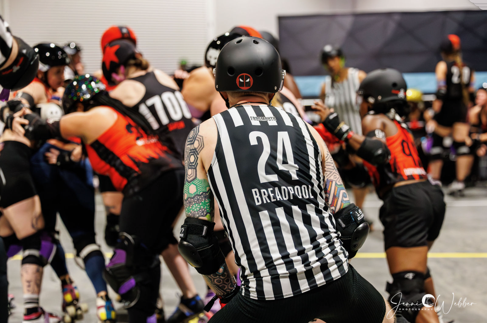

# Breadpool's Application

## Introduction

TODO

Click to expand sections.

---

## About Me

??? info "Profile"

    - Derby Name: Breadpool
    - Name: Timothy Hull
    - Pronouns: He/Him
    - Age: 44
    - Home Town: Portland, Oregon, USA
    - Birth Town: Annapolis, Maryland, USA
    - Languages: English, Brazilian Portuguese
    - Occupation: Automation Software Development Consultant
    - Hobbies: Brazilian Jiu-Jitsu Black Belt, amateur baker, jam skating

    { width="200" }

??? info "Inspiration"

    TODO

??? info "WFTDA" Certification

    TODO

---

## My Background

??? info "Competitive Sports"

    For as long as I can remember, I've lived and died for athletic competition.  My competitive background includes:

    - Youth soccer, baseball, basketball.
    - Junior high school cross-country, basketball, wrestling, track and field.
    - High school cross-country, basketball, biathlon, track and field.
    - U.S. Army recreational flag football.
    - Brazilian Jiu Jitsu.

??? info "Skating"

    I learned to skate when I was...

??? info "Non-Derby Officiating"

    I started officiating when I was sixteen, operating the scoreboard at high school basketball games, and I've since officiated:

    - High school football.
    - High school Army JROTC drill competition.
    - U.S. Army recreational flag football football.
    - BJJ tournaments at the local, regional, and international levels.

??? info "Derby Officiating"

    I began my derby officiating journey in August of 2022, somewhat by accident.  I did not realize what I started by accident became *the* thing I believe I was meant to do.  Since then, I've officiated 229 games (168 SO, 61 NSO). 

---

## How I Officiate

??? info "1. Preparation"

    TODO

??? info "2. Listening"

    TODO

??? info "3. Communication"

    TODO

??? info "4. Keeping Athletes on the Track"

    TODO

??? info "5. Zone Ownership"

    TODO

??? info "6. Hustle"

    TODO

??? info "7. Versatility"

    TODO

??? info "8. The Ultimate Teammate"

    TODO

    Supportive positivity.

??? info "2. Listening"

    TODO

---

## Why Me

??? info "My Purpose"

    I believe the events of my life prepared me for this opportunity, for this moment.  The intersection of my choices, my experiences, my successes, my failures, my dreams, and my life's purpose combined to make this the one thing I've wanted so badly that I've poured my entire life into having the chance.

??? info "What I've Overcome"

    20 x surgeries...

---

## Game Video Clips

---

## Thank You

---
