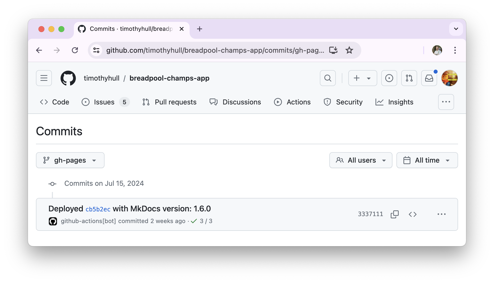
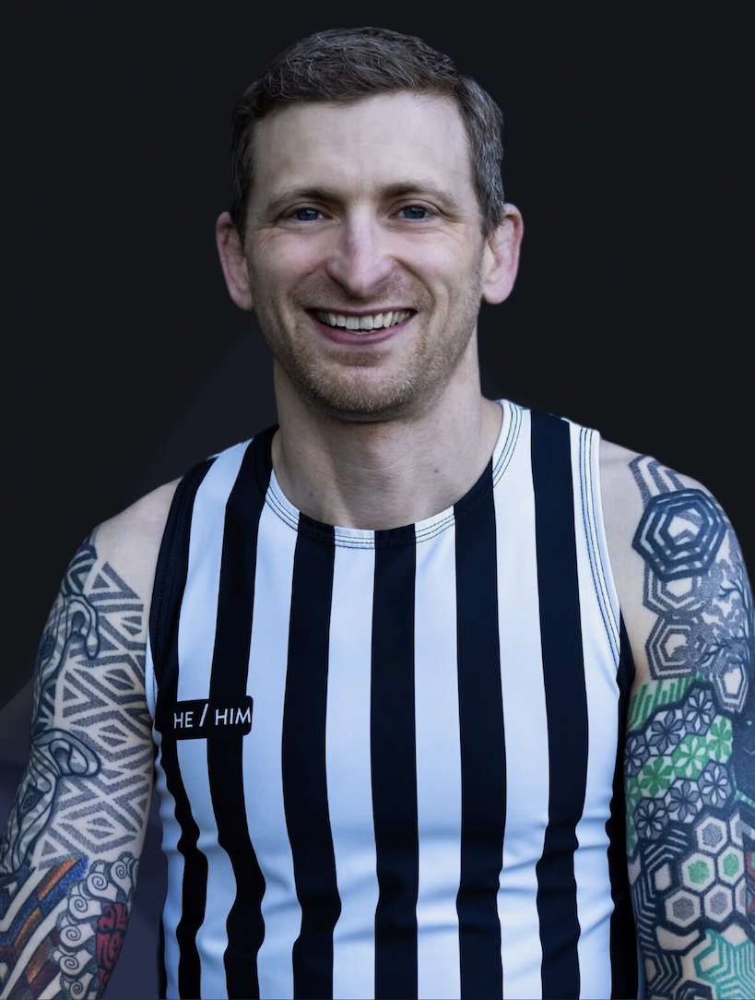
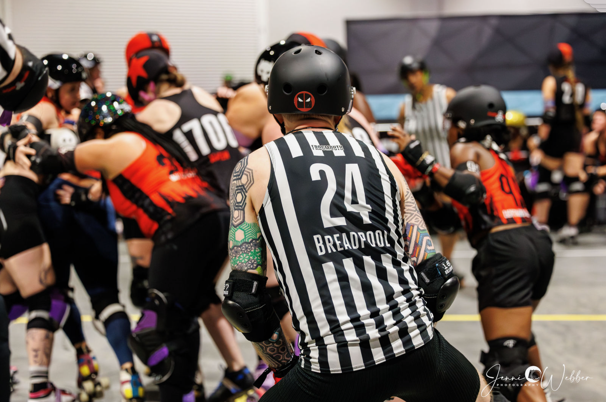
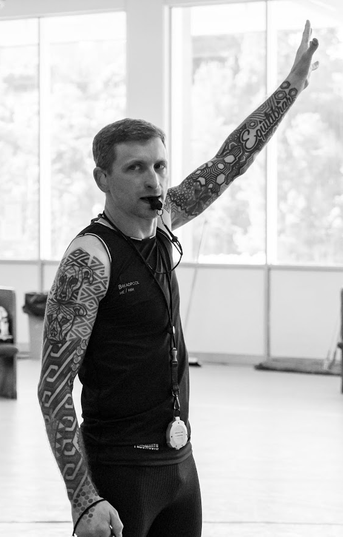

# Breadpool's Application

???+ warning "Anti-Cheating Statement"

    All changes to content on this site include date and time stamps to prove the application is complete before the due date.  You may [click here](https://github.com/timothyhull/breadpool-champs-app/commits/gh-pages "GitHub Changelog") to review the complete change history.(1)
    { .annotate }

    1.  !!! tip "Reveal Date and Time Stamp Details"

        Hover your mouse cursor over any "***...ago***" text to display a tooltip that reveals the change date and time stamp.

        <figure markdown>
        
        <figcaption style="font-size: 12px">
            Click to enlarge image
        </figure>

## About Me

=== "Introduction"

    I'm **Breadpool**(1), and, after a year of specific and intense preparation for this moment, this is my application to serve as a member of an officiating crew at the 2024 WFTDA Global Championship Tournament.
    { .annotate }

    1.  !!! info "Derby Name Meaning"

            My derby name is a combination of two things:

            1. I love to bake breads and pastries :fontawesome-solid-bread-slice:
            2. My superpower is recovering from injuries and surgeries :material-arm-flex:

    This application describes the unique person I am and why I believe TOSP, WFTDA, and the global roller derby community will benefit from choosing me to officiate at the 2024 Global Championship.

    I've spent over 40 hours preparing this application...because I want it *so* badly I can't do any less than the best I can possibly do.  That's how I've spent the last year, doing anything and everything I can to be ready for this moment, right now.  To know I gave it my all, did nothing less than my very best, and can submit this application believing nobody has trained harder.
    
    I prepared for this like a champion, and whether I make the cut or not, I will know that I had nothing left to give to show how much this means to me.

    <figure markdown>
    { width="300" "style="filter: drop-shadow(0 0 0.2rem black)" }
    <figcaption style="font-size: 12px">
        Breadpool (Timothy Hull) 
        Credit: [Mckay Grundstein-Helvey](https://www.instagram.com/mgh2pdx "@mgh2pdx on Instagram"){ target=_blank } :octicons-link-external-24:
    </figcaption>
    </figure>

=== "Profile"

    - **Name:** Breadpool (Timothy Hull)
    - **Pronouns:** He/Him
    - **Age:** 44
    - **Home Town:** Portland, Oregon, USA
    - **Birth Town:** Annapolis, Maryland, USA
    - **League Affiliation:** RCR
    - **Languages:** English, Brazilian Portuguese
    - **Occupation:** Automation Software Development Consultant
    - **Fun Fact:** BJJ Black Belt

    <figure markdown>
        { width="400" style="filter: drop-shadow(0 0 0.2rem black)"}
        <figcaption style="font-size: 12px">
            JR, 187 Killer Pads vs. Triple 8, RollerCon 2024 
            Credit: [Jenni Weber Photography](https://www.instagram.com/jenniwebberphotography "@jenniwebberphotography on Instagram"){ target=_blank } :octicons-link-external-24:
        </figcaption>
    </figure>

=== "Inspiration"

    - I seek to inspire people who have physical disabilities, just like me, to do more than they or perhaps the world believes they are capable of.
    - I am a physically disabled U.S. Army veteran, and I believe I fit within the category of people with hidden disabilities.
    - When I am an SO, nobody sees me and thinks I’m disabled, guesses I have an extensive injury history that includes 20 x surgeries, or has any idea how much daily work I do to physically function, gear up and skate, and excel at high-intensity physical activities.
    - Intense rehabilitation to recover from injuries is my superpower. For example, I served as an SO less than two weeks after a total hip replacement last year because I spent hours and hours each day rehabilitating, strengthening, and specifically training to be ready to skate.
    - **I want people with physical disabilities to see me as an example that's it’s possible for them to experience the joy and fulfillment from strenuous sports and activities.**

    <figure markdown>
        { width="350" style="filter: drop-shadow(0 0 0.2rem black)"}
        <figcaption style="font-size: 12px">
            OPR, RCR GNR vs. Texas Hustlers, November, 2023 
            Credit: [Jonathan Works Photography](https://www.facebook.com/worksphoto "worksphoto on Facebook"){ target=_blank } :octicons-link-external-24:
        </figcaption>
    </figure>

=== "WFTDA Certification"

    - Not certified at this time.
    - Applying for WFTDA Level 1 SO and NSO certifications after submitting this application.
    - Started on application in January.

    <figure markdown>
    { width="350" "style="filter: drop-shadow(0 0 0.2rem black)" }
    <figcaption style="font-size: 12px">
        JT, Female Division JRDA Playoffs, July, 2024 (Timothy Hull) 
        Credit: [Mckay Grundstein-Helvey](https://www.instagram.com/mgh2pdx "@mgh2pdx on Instagram"){ target=_blank } :octicons-link-external-24:
    </figcaption>
    </figure>

---

## My Goals

I train to officiate like a competitor, like I have to be the best, like good is the enemy of great.

I want to be a member of an officiating crew at the 2024 WFTDA Global Championship Tournament

that committed the last year of my life to doing anything I can to prepare...I believe I can be one of the best officials in the world.

OPR, JR, IPR positioning

---

## My Background

??? info "Competitive Sports"

    For as long as I can remember, I've lived and died for athletic competition.  My competitive background includes:

    - Youth soccer, baseball, basketball.
    - Junior high school cross-country, basketball, wrestling, track and field.
    - High school cross-country, basketball, biathlon, track and field.
    - U.S. Army recreational flag football.
    - Brazilian Jiu Jitsu.

??? info "Skating"

    I learned to skate when I was...

??? info "Non-Derby Officiating"

    I am newer to officiating for roller derby, I am not new to officiating.  I regularly officiate at Brazilian Jiu-Jitsu tournaments and have previous experience officiating for high school basketball and football.
    
    I’ve been competing in sports throughout my life, including over 20 years of Brazilian Jiu-Jitsu competition, and officiating is one of the ways I contribute to serving future generations of competitors while honoring the people who have been officials for my own competitive athletic experiences.

    I started officiating when I was sixteen, operating the scoreboard at high school basketball games, and I've since officiated:

    - High school football.
    - High school Army JROTC drill competition.
    - U.S. Army recreational flag football football.
    - BJJ tournaments at the local, regional, and international levels.

??? info "Derby Officiating"

    I began my derby officiating journey in August of 2022, somewhat by accident.  I did not realize what I started by accident became *the* thing I believe I was meant to do.  Since then, I've officiated 229 games (168 SO, 61 NSO). 

---

## How I Officiate

??? info "1. Extreme Positivity"

    **Officiating is a TEAM sport for me**

    - I show up with high enthusiasm, friendliness, excitement, and positivity to share with the officials I serve with, no matter how challenging game conditions might be.
    - No matter the game circumstances, I bring fist bumps, high-fives, and verbal "Let's go!" cues to support my peers.
    - I seek responsibility for my mistakes, make in-game adjustments, avoid dwelling on my mistakes so I keep my head in the game, and immediately extend apologies, where appropriate, to the people I impact with my mistakes.
    - I have the backs of my on- and off-skates crewmates, *always*, and they can count on me to encourage them in difficult situations.
    - When my officiating peers and leadership need me to make adjustments, I don’t dig my heels in about doing things a certain way, I give them my full support and do what they need me to do.

??? info "2. Preparation"

    - I practice developing and improving officiating skills, on- and off-skates at least 4 hours per week, and often upwards of 10 hours per week.
    - I actively seek feedback from other officials and relentlessly study game video to continuously learn and improve, and to position myself to best support safe and fair gameplay.
    - I physically train and condition 5-12 hours per week to maintain a high level of fitness, improve my ability to be in the best position to observe game action, and ensure I will not experience physical fatigue no matter how strenuous the environmental or game conditions might be.
    - I regularly study roller derby rules and cases to continuously develop a better understanding of roller derby rules theory.
    - I believe learning to understand rules theory helps me quickly work through complex situations in a way that supports the best and safest possible gameplay experience.

??? info "3. Listening"

    - I actively listen to officials, players, and coaches with genuine effort and concern to understand their points of view.
    - I seek to build trust by showing officials and teams they are heard and understood, even in cases where we may disagree with each other.
    - I actively solicit feedback from my peer officials by telling them no feedback will hurt my feelings.
    - For me, feedback is information I can use to be better today than I was yesterday, and I would rather understand my mistakes than ignore them.

??? info "4. Communication"

    - I speak to everyone with courtesy and respect, no matter how I am spoken to.
    - I do everything I can to actively communicate information with other officials in a way that promotes smooth, continuous game flow.

??? info "5. Keeping Athletes on the Track"

    - I believe gameplay is best when athletes are on the track, not in the penalty box, and I observe game action in a way that seeks to avoid issuing penalties whenever possible.
    - For any action that might create sufficient game impact to warrant penalties, I describe the game impact to myself in a way I can recite during an official review *before* I issue any penalties (e.g., "Low block on yellow 2-4; caused purple 2-4 to go down").
    - I maximize the use of verbal warnings, prescribed by gameplay rules, to help athletes avoid committing penalties.
    - When I issue penalties, I include as much "3-star" information as possible to help athletes understand my basis for issuing penalties and help them avoid being assessed with the same penalty again (e.g., "Yellow 2-4, forearm; bracing on an opponent.")

??? info "6. Zone Ownership"

    - I focus on officiating specifically within the confines of my area/zone of responsibility.
    - Said another way, I avoid immediately issuing penalties for actions I may not have the best point of view to observe during a jam.
    - If I believe I may have observed game action outside of my zone that warrants a penalty or even warrants reversing a penalty, I seek to discuss my observations with other officials during lineups to collaborate on our points of view and reach the best possible outcome.

    Santa Cruz C vs. G example with CMF.

??? info "7. Hustle"

    - No matter what I do, I move with the utmost sense of purpose, often sprinting back and forth, to show everyone around me that my concern for serving the teams and peers I officiate with is equivalent to that of the highest-level competitors.

??? info "8. Versatility"

    - I am specifically applying to serve as an OPR (first choice) or JR, the positions I have the most experience with, and I am willing to and capable of serving in any position of need, on- or off-skates, demonstrating that I place the utmost value on being an excellent follower while also demonstrating  leadership whenever required.
    - I actively work to keep my OHD balanced at roughly 2/3 SO roles 1/3 in NSO roles. off-skates to be as well-rounded and knowledgeable as an official as possible, and I am currently pursuing WFTDA SO and NSO Level I certification.

??? info "9. Courage To Do What's Right"

    Accept consequences for my actions.
    Santa Cruz S-OOB example.
    Rat vs. AoA example

??? info "10. The Ultimate Teammate"

    Fist bumps, "Let's Go!", high fives, etc.

---

## Officiating Positioning Methodology

??? info "OPR"

    TODO

    === "Rear"

        TODO 1

    === "Middle"

        TODO 2

    === "Front"

        TODO 3

??? info "JR"

    TODO

??? info "IPR"

    TODO

    === "Rear"

        TODO 1

    === "Front"

        TODO 2

---

## Conclusion

??? info "My Purpose"

    I believe the events of my life prepared me for this opportunity, for this moment.  The intersection of my choices, my experiences, my successes, my failures, my dreams, and my life's purpose combined to make this the one thing I've wanted so badly that I've poured my entire life into having the chance.

??? info "What I've Overcome"

    20 x surgeries...

---

## Thank You

---
