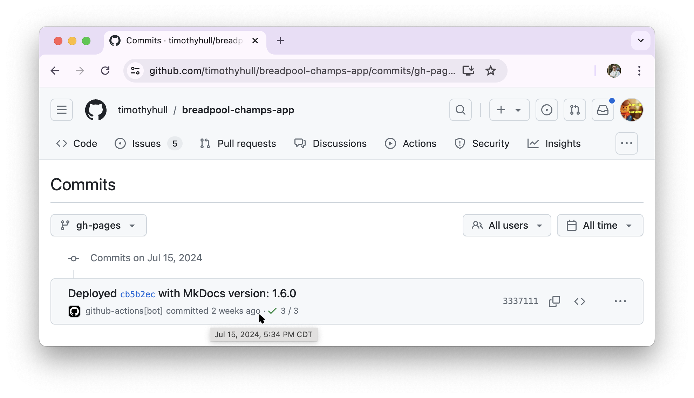
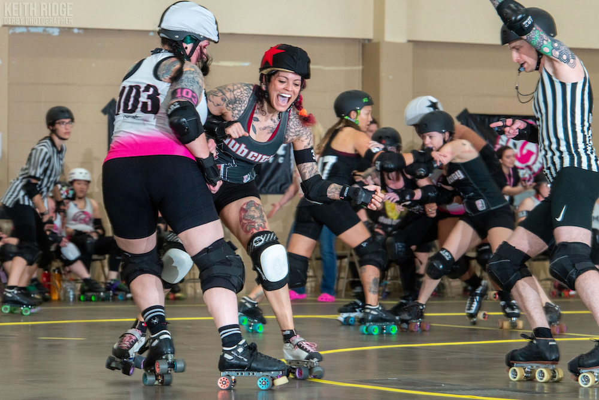
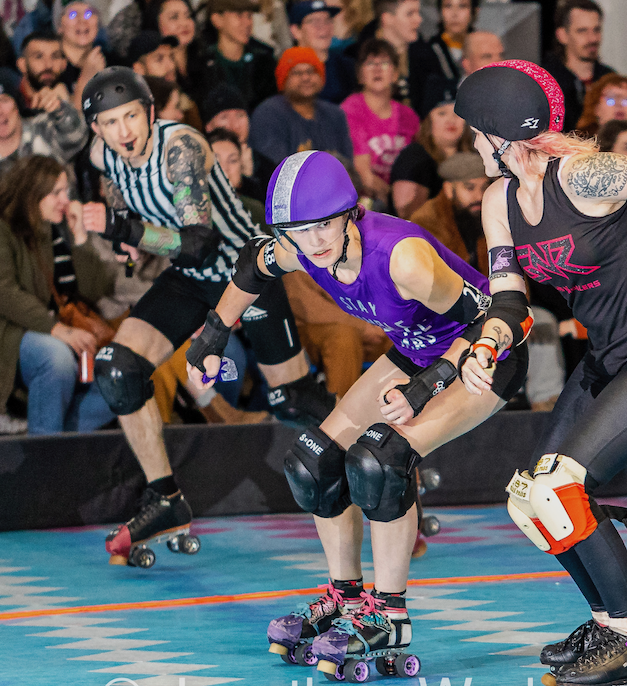

# Breadpool's Application

!!! warning "Anti-Cheating Statement"

    All changes to content on this site include date and time stamps to prove the application is complete before the due date.  You may [click here](https://github.com/timothyhull/breadpool-champs-app/commits/gh-pages "GitHub.io Changelog") to review the complete build history for this site, and [click here](https://github.com/timothyhull/breadpool-champs-app/commits "GitHub.com Changelog") to review the complete source code history.(1)
    { .annotate }

    1.  !!! magnifying-glass "View Date and Time Stamp Details"

        Hover your mouse cursor over any "***...ago***" text to display a tooltip that reveals the change date and time stamp.

        <figure markdown>
        { style="filter: drop-shadow(0 0 0.2rem black)" }
            <figcaption style="font-size: 12px">
                Click to enlarge image
            </figcaption>
        </figure>

## About Me

=== "Introduction"

    I'm **Breadpool**(1), and after a year of specific and intense preparation for this moment, this is my application to serve as a member of an officiating crew at the 2024 WFTDA Global Championship Tournament.
    { .annotate }

    1.  !!! reference "Derby Name Meaning"

            My derby name is a combination of two things:

            1. I love to bake breads and pastries :fontawesome-solid-bread-slice:
            2. My superpower is recovering from injuries and surgeries :material-arm-flex:

    This application describes the unique person I am and why I believe TOSP, WFTDA, and the global roller derby community will benefit from choosing me to officiate at the 2024 Global Championship. The effort I devoted to preparing this application is a small representation of the work I've done to have enough knowledge, experience, credibility, and skills to be ready to officiate for the highest-level teams and games in the world.
    
    Whether or not you select me to be a member of an officiating crew, I hope the information and attention to detail in this application demonstrate how much this opportunity means to me, how badly I want to earn a place on a crew, and that I've given absolutely everything I have to warrant your consideration.

    ??? numbers "My Application By The Numbers (click to expand)"

        - **229** - games officiated in the previous two years.
        - **134** - games officiated in the previous year.
        - **100+** - hours at a PT's office since 9/19/2023 to be ready to submit this application.
        - **50+** - hours I spent preparing this application.
        - **18** - events officiated in the previous year.
        - **16** - out-of-state trips to officiate derby in the previous year.
        - **0** - regrets for all of my work and sacrifice to be ready for this moment.

    <figure markdown>
    { width="300" style="filter: drop-shadow(0 0 0.2rem black)" }
        <figcaption style="font-size: 12px">
            Breadpool (Timothy Hull) 
            Credit: [Mckay Grundstein-Helvey](https://www.instagram.com/mgh2pdx "@mgh2pdx on Instagram"){ target=_blank } :octicons-link-external-24:
        </figcaption>
    </figure>

=== "Profile"

    - **Name:** Breadpool (Timothy Hull)
    - **Pronouns:** He/Him
    - **Age:** 44
    - **Home Town:** Portland, Oregon, USA
    - **Birth Town:** Annapolis, Maryland, USA
    - **League Affiliation:** RCR
    - **Languages:** English, Brazilian Portuguese
    - **Occupation:** Automation Software Development Consultant
    - **Fun Fact:** BJJ Black Belt

    <figure markdown>
    { width="500" style="filter: drop-shadow(0 0 0.2rem black)" }
        <figcaption style="font-size: 12px">
            JR, 187 Killer Pads vs. Triple 8, RollerCon 2024 
            Credit: [Jenni Weber Photography](https://www.instagram.com/jenniwebberphotography "@jenniwebberphotography on Instagram"){ target=_blank } :octicons-link-external-24:
        </figcaption>
    </figure>

=== "WFTDA Certification"

    I am not a WFTDA-certified official at this time.  However, achieving SO and NSO certification is very important to me.  For me, becoming a certified official and continuously seeking higher-level certification is symbolic of:
    
    1. My ongoing commitment to seek self-improvement.
    2. Demonstrating I support the WFTDA and their officiating procedures.

    ??? clipboard "Certification Timeline and Progress"

        - I started the process to become a certified official in September of 2022 by studying for and passing WFTDA's online SO and NSO officiating certification courses.
        - At the beginning of 2023, I set a personal goal to build sufficient game experience to credibly apply for Level I SO and NSO certifications in 2024.
        - At the beginning of 2024, I set a personal goal to apply for and achieve Level I SO and NSO certifications.
        - I received the final OOS I need to apply for Level I SO and NSO certifications in July of 2024.
        - I intend to complete and submit my WFTDA officiating certification applications as soon as I complete and submit my application to officiate at the 2024 WFTDA Global Championship Tournament.

    <figure markdown>
    { width="350" style="filter: drop-shadow(0 0 0.2rem black)" }
        <figcaption style="font-size: 12px">
            JT, Female Division JRDA Playoffs: Santa Cruz, June, 2024 (Timothy Hull) 
            Credit: [Mckay Grundstein-Helvey](https://www.instagram.com/mgh2pdx "@mgh2pdx on Instagram"){ target=_blank } :octicons-link-external-24:
        </figcaption>
    </figure>

---

## What I'm Applying For

I wish to serve as a member of an SO crew as an **OPR**, **JR**, or **IPR**.  I prefer to serve in an OPR or JR role, with no specific precedence between the two because I believe I am capable of officiating admirably in these roles for any level of play, including the highest-level play in the world.

Although I am not as strong of an IPR as I am an OPR or JR, I included the IPR role in my application because I want TOSP, the THR, and the CHRs to know they can confidently staff me in an IPR role if necessary (planned or unplanned), or in the ALTR role, knowing I can immediately enter a game with confidence and effectiveness in any SO role.

Please click to expand the sections below for detailed information about what you can expect from me and how I position myself in each SO role.

??? bread "What You Can Expect From Me"

    In any SO position, you can expect me to consistently exhibit and excel at:

    - Skating skills and speed that allow me to reliably be *exactly* where I need to be, rapidly recover if I am forced out of position, and avoid making contact with other players in situations where they may not be able to avoid making contact with me.
    - Awareness of which players have, earn, retain, lose, and reestablish superior positioning as players go out-of-bounds and return to in-bounds positions.
    - Thoroughly assessing and understanding which players initiate contact with other players.
    - Thoroughly assessing contact initiation game impact *before* I issue or decline to issue penalties.
    - Awareness of detailed information about the actions I observe that includes player-specific details (team and jersey number).
    - Continuous and dynamic positioning and repositioning to always be in the best position to observe game action.
    - Clear, slow, and slightly prolonged whistle blasts to help my peer officials in SO and NSO roles understand where and when to turn their attention.
    - Highly-visible, deliberately slow, and consistently repeated verbal and visual cues to help my peer officials in SO and NSO roles understand exactly what I am observing and reporting.
    - Delivering verbal and visual cues, including issuing penalties, while maintaining the appropriate positioning for my SO role.
    - Maintaining observation of players before, during, and after each jam to ensure any potential contact or communication between teams has coverage.
    - Tracking the number of players and the positions for each player on each team before and during a jam.
    - Understanding and applying WFTDA rules in keeping with established rules theory and the appropriate situational discretion and judgment to facilitate safe and fair gameplay.
    - Behaviors that show inclusiveness, courtesy, support, respect, and validation to NSOs.

    <figure markdown>
    { width="500" style="filter: drop-shadow(0 0 0.2rem black)" }
        <figcaption style="font-size: 12px">
            JR, Franky Panky, Tampa vs. Dub City, March, 2024 
            Credit: [Keith Ridge Derby Photos](https://www.facebook.com/keithridgederbyphotos "keithridgederbyphotos on Facebook"){ target=_blank } :octicons-link-external-24:
        </figcaption>
    </figure>

??? whistle "OPR-Specific"

    === "What I Bring To A Crew"

        As an OPR, you can expect me to consistently exhibit and excel at:

        - Demonstrating high-proficiency at each OPR position and the capacity to switch between any OPR position at any time without disrupting gameplay or creating a gap in coverage.
        - Being the earliest and most-decisive "dropping" OPR in the world, seeking to rapidly stop, accelerate in non-derby direction, and recover a new position whenever the speed of the pack has even the slightest position to put me and my peers out of position.
        - Awareness of earned passes within my zone, to support the JR's on my crew with accurate points reporting.
        - Frequently communicating with my OPR peers to ensure our collective positioning and ability to observe game actions is optimal.
        - Non-verbal communication with players (pointing) reporting to and returning from the penalty box to help ensure they enter and exit the track safely.
        - Lateral movement that allows me to predominantly face my entire body toward the pack, giving me the best possible view of the pack and allowing me to rapidly accelerate and decelerate in any direction, at any time.

        <figure markdown>
        { width="250" style="filter: drop-shadow(0 0 0.2rem black)" }
            <figcaption style="font-size: 12px">
                OPR, WFTDA NA West Playoffs, June, 2024 
                Credit: [ShutHerUp Photography](https://www.facebook.com/ShutHerUpPhotography "ShutHerUpPhotography on Facebook"){ target=_blank } :octicons-link-external-24:
            </figcaption>
        </figure>

    === "Positioning Methodology"

        - As a **rear** OPR, I am, generally:

            1. Parallel with a well-defined rear wall.
            2. Ready to rapidly accelerate in non-derby direction to follow and remain even with players up to the trailing edge of the rear engagement zone.
            3. Shifting to be slightly behind the rear wall when jammers approach, so I can observe contact to the real wall.
            3. Shifting to be slightly in front of the real wall to observe for illegal blocking techniques that create game impact.
            4. In position to observe player positioning relative to the jammer line and outside boundary at the start of each jam.

        - As a **middle** OPR, I am, generally:

            1. Parallel with a well-defined front wall of 3+ blockers wall.
            2. Ready to rapidly accelerate in non-derby direction to observe the rear wall from the front when the front wall has 2 or fewer blockers.
            3. Ready to reposition to be parallel with the rear wall when the rear OPR follows blockers moving in non-derby direction to the edge of the rear engagement zone, and ready to return to observing the front wall as the rear OPR reassumes control of the real wall.
            4. In position to observe player positioning relative to the pivot line and outside boundary at the start of each jam.

        - As a **front** OPR, I am, generally:

            1. 7-12 feet in front of the pack, directly next to the outside boundary looking in non-derby direction when the front wall has 3+ blockers.
            2. Ready to rapidly transition to be parallel with a front wall of 2 or fewer blockers while maintaining a position that prevents blockers from getting forward of my position.
            3. Ready to reposition to be parallel with the front wall when the middle OPR positions themselves to be parallel with the rear wall, and ready to return to a position forward of the front wall.

        <figure markdown>
        { width="400" style="filter: drop-shadow(0 0 0.2rem black)" }
            <figcaption style="font-size: 12px">
                OPR, Female Division JRDA Playoffs: Santa Cruz, June, 2024 
                Credit: [Mckay Grundstein-Helvey](https://www.instagram.com/mgh2pdx "@mgh2pdx on Instagram"){ target=_blank } :octicons-link-external-24:
            </figcaption>
        </figure>

??? whistle "JR"

        === "What I Bring To A Crew"

        As a JR, you can expect me to consistently exhibit and excel at:

        - Keeping eyes on my jammer at *all* times to ensure nothing they do goes unobserved.
        - Clear, kind, and supportive communication with my SK, before, during, and after each game.
        - Awareness of potential NOTT points and understanding of when a jammer earns and does not earn those points.
        - Timely and accurate tracking and recall, by player, of earned passes, points, superior position, and positional gain.
        - Confident points reporting immediately after a jam ends (after the fourth whistle, not the twelfth whistle).
        - Continuous monitoring of the relationship between what I report to my SK and the information on the scoreboard.
        - Awareness of the space I occupy, how my position impacts my peer JR, and the ability to adapt to support fluid, dynamic movement with my peer JR throughout a tournament.
        - Anticipating situations that may result in a star pass that is difficult to see.
        - Lateral movement that allows me to predominantly face my entire body toward my jammer, giving me the best possible view of my jammer and allowing me to rapidly accelerate and decelerate in any direction, at any time.
        - Precision responsiveness to jammer call-offs.

        <figure markdown>
        { width="400" style="filter: drop-shadow(0 0 0.2rem black)" }
            <figcaption style="font-size: 12px">
                JR, Ground Control vs. Y'allhalla, May, 2024 
                Credit: [Alvin Green Jr. Photography](https://www.instagram.com/algreenjr1 "@algreenjr1 on Instagram"){ target=_blank } :octicons-link-external-24:
            </figcaption>
        </figure>

    === "Positioning Methodology"

        - Before each jam, I identify my jammer and align myself with their position, making sure I can observe their actions before and after the jam starting whistle.
        - Precise alignment with my jammer throughout the duration of each jam in a way that allows me to continuously and accurately observe my jammer's position relative to other players.
        - Frequent use of wheel stopping techniques (hockey stops, power slides, etc.) to keep alignment with my jammer as they dynamically move within the pack and throughout the track.

        <figure markdown>
        { width="400" style="filter: drop-shadow(0 0 0.2rem black)" }
            <figcaption style="font-size: 12px">
                HR, AoA vs. Rat City, October, 2023 
                Credit: [Jonathan Works Photography](https://www.facebook.com/worksphoto "worksphoto on Facebook"){ target=_blank } :octicons-link-external-24:
            </figcaption>
        </figure>

??? whistle "IPR"

    === "What I Bring To A Crew"

        As IPR, front or rear, you can expect me to consistently exhibit and excel at:

        - Comfort and confidence working from the front or rear IPR positions, depending on the position preference of my HR/CHR.
        - Ability to define and track pack location plus adapt to the to the pack definition metrics of my peer IPR.
        - Ability to adapt to the pack reformation penalty metrics of my peer IPR such that reformation penalty distribution is fair and consistent.
        - Ability to monitor the precise location of skaters to accurately report pack conditions and movement.
        - Awareness of situations that may result in unexpected no-pack split scenarios.
        - Clear and loud verbal and visual cues that allow players to quickly understand and respond to warnings before penalty assessment.
        - Ability to rapidly and dynamically change my positioning and focus as game conditions and pack activities dictate.
        - Capacity to relay information information between officials, including relaying penalties from OPRs to PLTs.
        - Capacity to relay to JRs which players are OOP, NOTT, etc. and when, to support JRs accurately tracking and reporting points.
        - Ongoing communication with other officials about pack location and player positioning relative to the pack, specifically communicating the location of jammers relative to the pack and front engagement zone to JRs.
        - Awareness of where players re-enter the track relative to the front engagement zone.
        - Ability to "chase down" and issue an OOP warning to a pivot who leaves the front engagement zone while believing they are a jammer, after unsuccessfully taking a star pass.
        - Ability to rapidly accelerate while skating backward and skate backward at high speed without the need to look at the track boundary to ensure I remain off of the gameplay area.

        <figure markdown>
        { width="400" style="filter: drop-shadow(0 0 0.2rem black)" }
            <figcaption style="font-size: 12px">
                IPR, RCR Home Team Champs, June, 2024 
                Credit: [Jonathan Works Photography](https://www.facebook.com/worksphoto "worksphoto on Facebook"){ target=_blank } :octicons-link-external-24:
            </figcaption>
        </figure>

    === "Positioning Methodology"

        - As a **front** IPR, I am, generally:

            1. 7-10 feet in front of the pack, directly next to the inside boundary looking in non-derby direction when the pack is well-defined and managed by the rear IPR.
            2. Ready to rapidly transition to a position where I am centered on the pack when the rear IPR moves to follow players in the rear engagement zone.
            3. Ready to move out of the path of both JRs and quickly recover my original position.
            4. Ready to provide primary pack definition coverage for the rear IPR in the event they are not available at the start of a jam or become unavailable during a jam.
        
        - As a **rear** IPR, I am, generally:

            1. Centered on the pack when the pack is well-defined.
            2. Ready to rapidly accelerate in non-derby direction to follow and remain even with players up to the trailing edge of the rear engagement zone.
            3. Shifting to be slightly behind the rear wall when jammers approach, so I can observe contact to the real wall.
            4. Shifting to be slightly in front of the real wall to observe for illegal blocking techniques that create game impact.
            5. Ready to move out of the path of both JRs and quickly recover my original position.
            6. In position to observe player positioning relative to the jammer line and inside boundary at the start of each jam.

        <figure markdown>
        { width="400" style="filter: drop-shadow(0 0 0.2rem black)" }
            <figcaption style="font-size: 12px">
                IPR, Colorado Chaos, JRDA Sanctioned Game, May, 2024 
                Credit: [Alvin Green Jr. Photography](https://www.instagram.com/algreenjr1 "@algreenjr1 on Instagram"){ target=_blank } :octicons-link-external-24:
            </figcaption>
        </figure>

??? clipboard "ALTR"

    === "What I Bring To A Crew"

        I take the ALTR role very seriously and seek opportunities to serve as an ALTR.  You can expect me to volunteer to serve as an ALTR with enthusiasm, engagement, and a focus on helping my officiating peers excel. As an ALTR, you can expect me to consistently exhibit and excel at:

        - Preparing myself physically before a game such that I could be activated at any moment of need, and maintaining that physical readiness throughout a game.
        - Maintaining situational awareness of game action so I am ready to enter a game or provide relevant feedback at any moment.
        - Readiness for activation to any position.
        - Readiness to provide individual or crew feedback at the request of the HR/CHR.
        - Understanding how to accurately record essential OR information.
        - Readiness to report game summary information (team/or penalty counts, number of timeouts remaining, etc.) to the HR/CHR at their request.

        <figure markdown>
        { width="400" style="filter: drop-shadow(0 0 0.2rem black)" }
            <figcaption style="font-size: 12px">
                ALTR, RCR Home Team Champs, June, 2024 
                Credit: Divo
            </figcaption>
        </figure>

---

## What This Means To Me

=== "Inspiration"

    - I seek to inspire people who have physical disabilities, just like me, to do more than they or perhaps the world believes they are capable of.
    - I am a physically disabled U.S. Army veteran, and I believe I fit within the category of people with hidden disabilities.
    - When serve in an SO role, nobody sees me and thinks I’m disabled, guesses I have an extensive injury history that includes 20 x surgeries, or has any idea how much daily work I do to physically function, gear up and skate, and excel at high-intensity physical activities.
    - Intense rehabilitation to recover from injuries is my superpower. For example, I served as an SO less than two weeks after a total hip replacement last year because I spent hours and hours each day rehabilitating, strengthening, and specifically training to be ready to skate.
    - **I want people with physical disabilities to see me as an example that's it’s possible for them to experience the joy and fulfillment from strenuous sports and activities.**

    <figure markdown>
    { width="350" style="filter: drop-shadow(0 0 0.2rem black)" }
        <figcaption style="font-size: 12px">
            OPR, RCR GNR vs. Texas Hustlers, November, 2023 
            Credit: [Jonathan Works Photography](https://www.facebook.com/worksphoto "worksphoto on Facebook"){ target=_blank } :octicons-link-external-24:
        </figcaption>
    </figure>

=== "Hope"

    I've loved competitive athletics my whole life.  I lost the ability to compete

    Todo - I train to officiate like a competitor, like I have to be the best, like good is the enemy of great.

    <figure markdown>
    { width="400" style="filter: drop-shadow(0 0 0.2rem black)" }
        <figcaption style="font-size: 12px">
            IPR, RCR Home Team Champs, June, 2024 
            Credit: Divo
        </figcaption>
    </figure>

---

## My Officiating Background

=== "Non-Derby Officiating"

    I am newer to officiating for roller derby, although I am not new to officiating.  

    I’ve been competing in sports throughout my life, including over 20 years of Brazilian Jiu-Jitsu competition, and officiating is one of the ways I contribute to serving future generations of competitors while honoring the people who have officiated for my own competitive athletic experiences.

    I started officiating when I was sixteen, operating the scoreboard at high school basketball games, and I've since officiated:

    - High school football.
    - High school Army JROTC drill competition.
    - U.S. Army recreational flag football.
    - BJJ tournaments at the local, regional, and international levels.

    <figure markdown>
    { width="350" style="filter: drop-shadow(0 0 0.2rem black)" }
        <figcaption style="font-size: 12px">
            Referee, The Revolution 52, Puyallup, WA, July 2024 
            Credit: [Jason Tracy Photography](https://www.instagram.com/pnwphotoj "@pnwphotoj on Instagram"){ target=_blank } :octicons-link-external-24:
        </figcaption>
    </figure>

=== "Derby Officiating"

    I began my derby officiating journey in August of 2022, although somewhat by accident.  My daughter was new to the roller derby community and wanted to spend more time on skates than was available to her in practices and scrimmages.  She decided to start attending officiating practice and asked that I join her so she wouldn't feel alone.
    
    I wanted to support my daughter and the roller derby community, and having skated and officiated in different capacities for the majority of my life, I felt comfortable giving roller derby officiating a shot.  I had no idea that I would leave that practice feeling like officiating roller derby was *the* thing I was meant to do.
    
    Since that day, I've poured my heart and soul into becoming a better official, believing I can serve people, many of whom live within social margins, in a way that allows them to live safer, more fulfilling lives.

    <figure markdown>
    { width="500" style="filter: drop-shadow(0 0 0.2rem black)" }
        <figcaption style="font-size: 12px">
            JR, Ground Control vs. Y'allhalla, May, 2024 
            Credit: [Alvin Green Jr. Photography](https://www.instagram.com/algreenjr1 "@algreenjr1 on Instagram"){ target=_blank } :octicons-link-external-24:
        </figcaption>
    </figure>

---

## How I Officiate

I believe the best officiating happens when a crew behaves like a selfless, supportive, and blameless team that focuses on being better today than they were yesterday.  These are the qualities you can expect from me as a member of an officiating crew:

??? bread "1. My Mindset"

    - I approach officiating just like I do playing any competitive sport, with the exception that my opponent isn't another person or team.
    - In my mind, **mistakes** are the opponent I ferociously train to beat, while recognizing mistakes are a relentless opponent that will never allow me to be rest.
    - I respect my opponent, although I do not fear them on any stage.
    - I seek to challenge my opponent at the highest levels because I'm driven to "win," and I do whatever it takes to be successful on the biggest stages.
    - "Winning" means my peers and I supported safe, fair, and gameplay in which the competing teams feel like they control the outcome.
    - I give my all to be the best teammate anyone has ever had, someone who my peers trust, feel safe with, and enjoy being around, and the most humble empathetic official anyone has ever known.

??? bread "2. Extreme Positivity"

    - I show up with high enthusiasm, friendliness, excitement, and positivity to share with the officials I serve with, no matter how challenging game conditions might be.
    - Regardless of the circumstances, I bring fist bumps, high-fives, and verbal "Let's go!" cues to support and encourage my peers throughout the duration of a contest.
    - I seek responsibility for my mistakes, make in-game adjustments, avoid dwelling on my mistakes so I keep my head in the game, and immediately extend apologies, where appropriate, to the people I impact with my mistakes.
    - I have the backs of my on- and off-skates crewmates, *always*, and they can count on me to encourage them in difficult situations.
    - When my officiating peers and leadership need me to make adjustments, I don’t dig my heels in about doing things a certain way, I give them my full support and do what they need me to do.

??? bread "3. Strenuous Preparation"

    - I practice developing and improving officiating skills, on- and off-skates at least 4 hours per week, and often upwards of 10 hours per week.
    - I actively seek feedback from other officials and relentlessly study game video to continuously learn and improve, and to position myself to best support safe and fair gameplay.
    - I physically train and condition 5-12 hours per week to maintain a high level of fitness, improve my ability to be in the best position to observe game action, and ensure I will not experience physical fatigue no matter how strenuous the environmental or game conditions might be.
    - I regularly study roller derby rules and cases to continuously develop a better understanding of roller derby rules theory because I believe learning to understand rules theory helps me quickly work through complex situations in a way that supports the best and safest possible gameplay experience.

??? bread "4. Empathic Listening"

    - I actively listen to officials, players, and coaches with genuine effort and concern to understand their points of view.
    - I seek to build trust by showing officials and teams they are heard and understood, even in cases where we may disagree with each other.
    - I actively solicit feedback from my peer officials by telling them no feedback will hurt my feelings.
    - For me, feedback is information I can use to be better today than I was yesterday, and I want to understand my mistakes, not ignore or hide from them.

??? bread "5. Clear and Kind Communication"

    - I speak to everyone with courtesy and respect, no matter how I am spoken to.
    - I do everything I can to actively communicate information with other officials in a way that promotes smooth, continuous game flow.

??? bread "6. Keeping Athletes on the Track"

    - I believe gameplay is best when athletes are on the track, not in the penalty box, and I observe game action in a way that seeks to avoid issuing penalties whenever possible.
    - For any action that might create sufficient game impact to warrant penalties, I describe the game impact to myself in a way I can recite during an official review *before* I issue any penalties (e.g., "Low block on yellow 2-4; caused purple 2-4 to go down").
    - I maximize the use of verbal warnings, prescribed by gameplay rules, to help athletes avoid committing penalties.
    - When I issue penalties, I include as much "3-star" information as possible to help athletes understand my basis for issuing penalties and help them avoid being assessed with the same penalty again (e.g., "Yellow 2-4, forearm; bracing on an opponent.")

??? bread "7. Zone Ownership"

    - I focus on officiating specifically within the confines of my area/zone of responsibility.
    - Said another way, I avoid immediately issuing penalties for actions I may not have the best point of view to observe during a jam.
    - If I believe I may have observed game action outside of my zone that warrants a penalty or even warrants reversing a penalty, I seek to discuss my observations with other officials during lineups to collaborate on our points of view and reach the best possible outcome.

    Santa Cruz C vs. G example with CMF.

??? bread "8. Hustle"

    - No matter what I do, I move with the utmost sense of purpose, often sprinting back and forth, to show everyone around me that my concern for serving the teams and peers I officiate with is equivalent to that of the highest-level competitors.

    - If I end up on the ground, I will be back on my feet instantaneously.  Jiu-Jitsu and Judo backgrounds, plus something I practice.

??? bread annotate "9. Versatility"

    - Although this application is specific to SO roles, I work hard to continuously build skill and experience at each officiating position, on- and off-skates because I believe learning and practicing each role helps make me a better official and teammate for my SO and NSO peers. (1)
    - I actively work to keep my OHD balanced between SO and NSO roles, officiating ≈2/3 of games in SO roles and ≈1/3 of games in NSO roles.
    - Whenever needed, I am comfortable serving in any SO or NSO role, with or without advanced notice.

1. !!! tip "Caveat"

    Although I practice working with CRG extensively, including IGRF and statsbook preparation, I do not have game experience in the role of HNSO.

??? bread "10. Courage To Do What's Right"

    Accept consequences for my actions.
    Santa Cruz S-OOB example.
    Rat vs. AoA example

---

## Conclusion

I believe the events of my life prepared me for this opportunity, for this moment.  The intersection of my choices, my experiences, my successes, my failures, my dreams, and my life's purpose combined to make this the one thing I've wanted so badly that I've poured my entire life into having the chance.

Thank you for the opportunity to apply and for considering my application.

<figure markdown>
{ width="500" style="filter: drop-shadow(0 0 0.2rem black)" }
    <figcaption style="font-size: 12px">
        OPR, Franky Panky JRDA Sanctioned, March, 2024 
        Credit: [Keith Ridge Derby Photos](https://www.facebook.com/keithridgederbyphotos "keithridgederbyphotos on Facebook"){ target=_blank } :octicons-link-external-24:
    </figcaption>
</figure>

---
